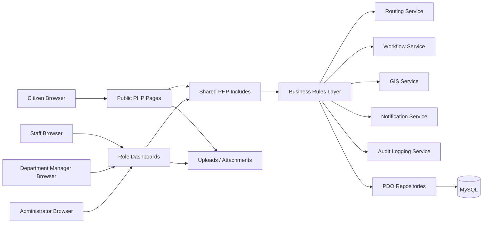
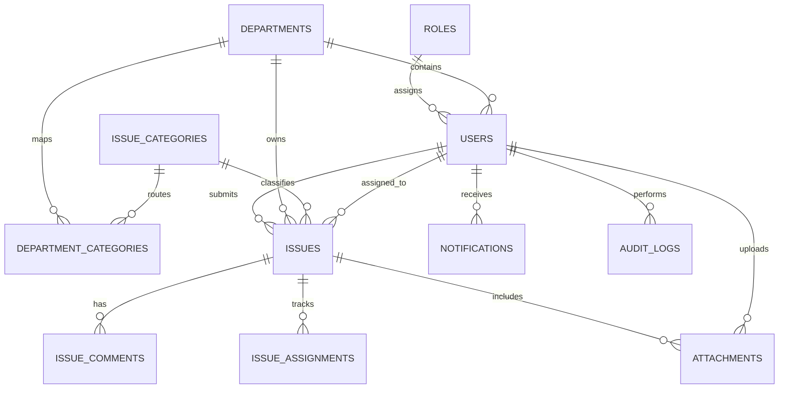
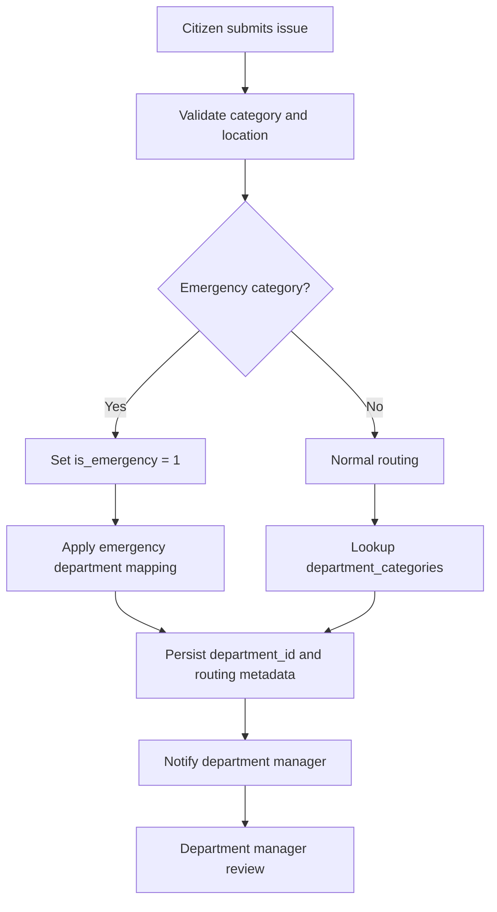
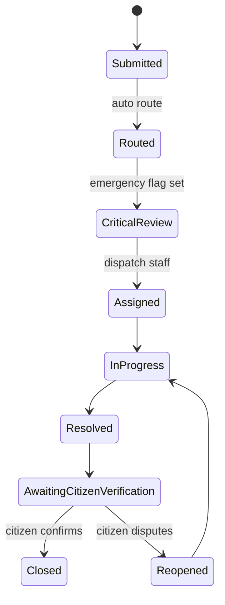
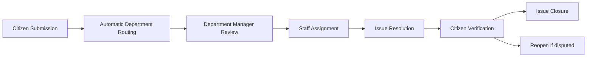

# Smart Civic App Enterprise Extension Specification

## Scope

This document extends the existing Smart Civic App without redesigning it from scratch. It preserves the current plain PHP, MySQL, Bootstrap 5, JavaScript, Leaflet.js, OpenStreetMap, HTML5, and CSS3 stack, and introduces a department-based operating model, emergency incident handling, richer GIS features, stronger RBAC, and updated dashboards.

The current implementation already supports registration, login, RBAC, issue reporting, issue tracking, image uploads, notifications, comments, dashboard analytics, report generation, audit logs, geolocation, maps, heatmaps, and staff assignment. The design below extends those capabilities instead of replacing them.

## Design Principles

- Preserve existing public pages, helpers, and database conventions.
- Add new tables and fields only where the current model cannot support the required workflow.
- Keep business logic in reusable PHP helpers and service-style include files.
- Make department routing configurable and auditable.
- Treat emergency incidents as a first-class issue type with higher priority and faster routing.
- Keep UI changes incremental and Bootstrap 5 compatible.
- Use prepared statements, CSRF protection, output encoding, and secure upload validation everywhere.

## Updated System Architecture



### Logical Layers

The current application should remain page-driven, but the internal responsibilities should be separated as follows:

- Presentation layer: `auth/`, `citizen/`, `staff/`, `admin/`, `issues/`, and shared headers, sidebars, and footers.
- Shared service layer: `includes/` for auth checks, issue helpers, routing helpers, validation helpers, logging helpers, and dashboard queries.
- Data layer: `database/` schema and migrations, using PDO and parameterized queries only.
- Storage layer: issue attachments stored outside executable paths where possible, with controlled public access through image proxy or download scripts.

## Module Structure

Recommended extension structure within the existing repository:

```text
config/
includes/
  auth.php
  issues.php
  logging.php
  routing.php
  departments.php
  notifications.php
  dashboard.php
  gis.php
database/
  schema.sql
  migrations/
admin/
  departments.php
  department-managers.php
  routing-rules.php
  emergency-dashboard.php
staff/
  dashboard.php
  issues.php
  map.php
citizen/
  dashboard.php
  issues.php
  report-issue.php
issues/
  map.php
  map-data.php
  view.php
docs/
  smart-civic-enterprise-extension.md
```

## Updated User Roles

The system should support four roles:

- Citizen
- Staff
- Department Manager
- Administrator

### Role Responsibilities

| Role | Primary Responsibilities | Restrictions |
| --- | --- | --- |
| Citizen | Register, submit issues, upload evidence, track progress, verify resolution, comment on own issues | Cannot access internal queues or manage users |
| Staff | View assigned departmental issues, update status, comment, close work items, use maps, receive notifications | Cannot create admins or managers, cannot access other departments |
| Department Manager | Manage staff in own department, review routed issues, assign work, monitor performance, view departmental reports | Cannot create admins, cannot create other department managers, cannot change system-wide settings, cannot access other departments |
| Administrator | Full system administration, department management, routing rules, all reports, audit, maintenance, global settings | Subject to security policy and audit logging |

## Updated RBAC Structure

The current permission system should be extended, not replaced. Existing `permissions` and `role_permissions` tables should be retained and expanded.

### Recommended Permissions

| Permission Key | Module | Description |
| --- | --- | --- |
| `view_issues` | issues | View issue records |
| `create_issues` | issues | Create issue records |
| `edit_issues` | issues | Edit issue records |
| `assign_issues` | issues | Assign issues to staff |
| `manage_departments` | departments | Create, edit, activate, and manage departments |
| `manage_department_staff` | departments | Create and manage staff in own department |
| `view_department_dashboard` | dashboards | View department-level analytics |
| `view_department_reports` | reports | View department-level reports |
| `manage_routing_rules` | routing | Configure category-to-department mappings |
| `view_emergency_dashboard` | emergency | View emergency incident dashboard |
| `manage_users` | users | Manage users and roles |
| `manage_settings` | settings | Manage global configuration |
| `view_audit_trail` | audit | View audit logs |
| `view_analytics` | analytics | View dashboards and KPI summaries |

### Permission Matrix

| Capability | Citizen | Staff | Department Manager | Administrator |
| --- | --- | --- | --- | --- |
| Submit issue | Yes | No | No | No |
| View own issue | Yes | No | No | Yes |
| View departmental issues | No | Yes | Yes | Yes |
| Update status | No | Yes | Yes | Yes |
| Assign to staff | No | No | Yes | Yes |
| Create staff accounts | No | No | Yes | Yes |
| Create managers | No | No | No | Yes |
| Manage departments | No | No | No | Yes |
| Manage routing table | No | No | No | Yes |
| View dashboards | Limited | Yes | Yes | Yes |
| View reports | Own issues only | Department | Department | All |
| Access audit logs | No | No | Limited | Yes |

## Department Management Model

### Department Rules

- Every issue belongs to exactly one department.
- Every staff user belongs to exactly one department.
- Every department has exactly one active manager at a time.
- Administrators can create, edit, activate, or deactivate departments.
- Department managers can only operate inside their own department boundary.

### Recommended Departments


### Department CRUD Operations

| Operation | Description | Validation |
| --- | --- | --- |
| Create | Add a department | Name and slug must be unique; manager must be active |
| Read | View departments and summaries | Support active/inactive filters and search |
| Update | Edit department profile and manager | Manager changes must be audited |
| Deactivate | Disable routing to the department | Unresolved issues should be reassigned first |
| Reactivate | Restore the department | Only active mappings may resume |

### Department Validation Rules

- Department names must be unique.
- Department slugs must be unique and URL-safe.
- One active manager per department.
- A department cannot be deactivated while unresolved issues remain unless reassignment has already been completed.
- Department managers must have the Department Manager role.

### Department Access Control Rules

- Administrators can manage all departments.
- Department managers can view only their own department.
- Staff can view only their own department.
- Citizens cannot access department administration screens.

## Database Redesign

The schema should extend the existing tables with the following additions.

### Access Control Logic

Apply access checks in this order:

1. Verify the user is authenticated.
2. Verify the user role is allowed.
3. Verify the required permission exists.
4. Verify the record belongs to the user's department unless the user is an administrator.
5. Verify citizens only access their own records.
6. Verify the requested workflow transition is permitted for that role.

Recommended helper rules:

- `require_role(['admin', 'department_manager'])` for department management pages.
- `require_permission('manage_departments')` for department create/edit/deactivate actions.
- `require_department_scope($departmentId)` for manager and staff issue pages.
- `require_csrf_token()` for every state-changing request.

### Recommended Category-to-Department Mapping

| Issue Category | Department |
| --- | --- |
| Road Damage | Roads and Engineering |
| Potholes | Roads and Engineering |
| Garbage Collection | Sanitation Services |
| Drainage Issues | Drainage and Environment |
| Streetlight Faults | Electrical Services |
| Water Supply Issues | Water Services |
| Public Park Damage | Parks and Recreation |
| Fire Outbreaks | Public Safety and Emergency Response |
| Traffic Accidents | Public Safety and Emergency Response |
| Electrical Hazards | Public Safety and Emergency Response |

### Audit Log Design

Track each important departmental action with a structured audit record. Each row should capture:

- user_id
- action
- affected_table
- affected_record
- department_id when relevant
- details or metadata
- timestamp
- IP address and user agent where available

Recommended audit events:

- department_created
- department_updated
- department_deactivated
- manager_assigned
- staff_created
- staff_activated
- staff_deactivated
- issue_routed
- issue_assigned
- issue_reassigned
- issue_resolved
- citizen_verified_issue
- issue_closed
- routing_overridden

### Audit Reporting Features

- filter by user, department, action, and date range
- export CSV or PDF summaries for demonstrations
- highlight risky actions such as routing overrides and deactivations
- show recent administrative changes on the admin dashboard

### Department Manager UI Forms

Required screens:

- Department manager dashboard
- Create staff account form
- Edit staff account form
- Staff activation/deactivation confirmation
- Issue assignment modal
- Issue reassignment modal
- Department performance report screen

Staff creation form fields should include:

- full name
- email
- phone
- employee number
- job title
- department, shown read-only and inherited
- active status
- temporary password or password setup link

Validation rules:

- manager cannot choose a different department
- role must be forced to Staff
- email must be unique
- password must meet policy requirements
- create action must store created_by and created_at

### Staff Business Logic

- New staff users inherit the manager's department automatically.
- The role is always forced to Staff.
- The UI must not expose role selection to department managers.
- A department manager may toggle active status only for staff in the same department.
- Every create or deactivate action must update the audit trail and notify the manager.

### `users`

Recommended new fields:

| Field | Type | Notes |
| --- | --- | --- |
| `department_id` | BIGINT UNSIGNED NULL | Links staff and managers to a department |
| `created_by` | BIGINT UNSIGNED NULL | Tracks who created the account |
| `created_at` | TIMESTAMP | Already present |
| `is_active` | TINYINT(1) | Already present |
| `deleted_at` | TIMESTAMP NULL | Already present in the current direction |
| `deleted_by` | BIGINT UNSIGNED NULL | Already present in the current direction |

### `departments`

```sql
CREATE TABLE IF NOT EXISTS departments (
    id BIGINT UNSIGNED AUTO_INCREMENT PRIMARY KEY,
    name VARCHAR(150) NOT NULL,
    slug VARCHAR(160) NOT NULL UNIQUE,
    description VARCHAR(255) NULL,
    manager_user_id BIGINT UNSIGNED NULL,
    is_active TINYINT(1) NOT NULL DEFAULT 1,
    created_by BIGINT UNSIGNED NULL,
    updated_by BIGINT UNSIGNED NULL,
    created_at TIMESTAMP NOT NULL DEFAULT CURRENT_TIMESTAMP,
    updated_at TIMESTAMP NOT NULL DEFAULT CURRENT_TIMESTAMP ON UPDATE CURRENT_TIMESTAMP,
    UNIQUE KEY uq_departments_name (name),
    KEY idx_departments_manager_user_id (manager_user_id),
    KEY idx_departments_is_active (is_active),
    CONSTRAINT fk_departments_manager_user
        FOREIGN KEY (manager_user_id) REFERENCES users (id)
        ON UPDATE CASCADE
        ON DELETE SET NULL,
    CONSTRAINT fk_departments_created_by
        FOREIGN KEY (created_by) REFERENCES users (id)
        ON UPDATE CASCADE
        ON DELETE SET NULL,
    CONSTRAINT fk_departments_updated_by
        FOREIGN KEY (updated_by) REFERENCES users (id)
        ON UPDATE CASCADE
        ON DELETE SET NULL
) ENGINE=InnoDB;
```

### `department_categories`

This table provides the configurable routing table.

```sql
CREATE TABLE IF NOT EXISTS department_categories (
    id BIGINT UNSIGNED AUTO_INCREMENT PRIMARY KEY,
    department_id BIGINT UNSIGNED NOT NULL,
    issue_category_id INT UNSIGNED NOT NULL,
    is_emergency_category TINYINT(1) NOT NULL DEFAULT 0,
    default_priority VARCHAR(20) NOT NULL DEFAULT 'medium',
    routing_order INT NOT NULL DEFAULT 0,
    is_active TINYINT(1) NOT NULL DEFAULT 1,
    created_by BIGINT UNSIGNED NULL,
    created_at TIMESTAMP NOT NULL DEFAULT CURRENT_TIMESTAMP,
    UNIQUE KEY uq_department_categories_map (department_id, issue_category_id),
    KEY idx_department_categories_department_id (department_id),
    KEY idx_department_categories_issue_category_id (issue_category_id),
    KEY idx_department_categories_is_active (is_active),
    CONSTRAINT fk_department_categories_departments
        FOREIGN KEY (department_id) REFERENCES departments (id)
        ON UPDATE CASCADE
        ON DELETE CASCADE,
    CONSTRAINT fk_department_categories_issue_categories
        FOREIGN KEY (issue_category_id) REFERENCES issue_categories (id)
        ON UPDATE CASCADE
        ON DELETE RESTRICT,
    CONSTRAINT fk_department_categories_created_by
        FOREIGN KEY (created_by) REFERENCES users (id)
        ON UPDATE CASCADE
        ON DELETE SET NULL
) ENGINE=InnoDB;
```

### `issues`

Recommended new fields:

| Field | Type | Purpose |
| --- | --- | --- |
| `department_id` | BIGINT UNSIGNED NULL | Current owning department |
| `routed_by` | BIGINT UNSIGNED NULL | User or system actor that routed the issue |
| `routing_rule_id` | BIGINT UNSIGNED NULL | Rule that performed the routing decision |
| `is_emergency` | TINYINT(1) NOT NULL DEFAULT 0 | Marks emergency incidents |
| `emergency_level` | VARCHAR(20) NOT NULL DEFAULT 'none' | Used for critical incidents |
| `citizen_verified_at` | TIMESTAMP NULL | Marks citizen verification |
| `closed_at` | TIMESTAMP NULL | Marks closure |
| `closed_by` | BIGINT UNSIGNED NULL | Closure actor |

Recommended status values in `issue_status`:

- submitted
- under_review
- assigned
- in_progress
- resolved
- awaiting_citizen_verification
- closed
- rejected

### `issue_assignments`

This table should preserve assignment history.

```sql
CREATE TABLE IF NOT EXISTS issue_assignments (
    id BIGINT UNSIGNED AUTO_INCREMENT PRIMARY KEY,
    issue_id BIGINT UNSIGNED NOT NULL,
    assigned_by BIGINT UNSIGNED NOT NULL,
    assigned_to BIGINT UNSIGNED NOT NULL,
    assigned_at TIMESTAMP NOT NULL DEFAULT CURRENT_TIMESTAMP,
    unassigned_at TIMESTAMP NULL,
    assignment_note TEXT NULL,
    is_current TINYINT(1) NOT NULL DEFAULT 1,
    KEY idx_issue_assignments_issue_id (issue_id),
    KEY idx_issue_assignments_assigned_to (assigned_to),
    KEY idx_issue_assignments_is_current (is_current),
    CONSTRAINT fk_issue_assignments_issues
        FOREIGN KEY (issue_id) REFERENCES issues (id)
        ON UPDATE CASCADE
        ON DELETE CASCADE,
    CONSTRAINT fk_issue_assignments_assigned_by
        FOREIGN KEY (assigned_by) REFERENCES users (id)
        ON UPDATE CASCADE
        ON DELETE RESTRICT,
    CONSTRAINT fk_issue_assignments_assigned_to
        FOREIGN KEY (assigned_to) REFERENCES users (id)
        ON UPDATE CASCADE
        ON DELETE RESTRICT
) ENGINE=InnoDB;
```

### `issue_comments`

Recommended additions:

- `comment_type` to distinguish public and internal notes.
- `department_visible` or `is_public` can remain if already used.
- `deleted_at` and `deleted_by` should remain for recovery and audit.

### `attachments`

```sql
CREATE TABLE IF NOT EXISTS attachments (
    id BIGINT UNSIGNED AUTO_INCREMENT PRIMARY KEY,
    issue_id BIGINT UNSIGNED NOT NULL,
    uploaded_by BIGINT UNSIGNED NOT NULL,
    file_name VARCHAR(255) NOT NULL,
    stored_name VARCHAR(255) NOT NULL,
    file_path VARCHAR(255) NOT NULL,
    mime_type VARCHAR(120) NOT NULL,
    file_size INT UNSIGNED NOT NULL,
    is_public TINYINT(1) NOT NULL DEFAULT 0,
    created_at TIMESTAMP NOT NULL DEFAULT CURRENT_TIMESTAMP,
    KEY idx_attachments_issue_id (issue_id),
    KEY idx_attachments_uploaded_by (uploaded_by),
    CONSTRAINT fk_attachments_issues
        FOREIGN KEY (issue_id) REFERENCES issues (id)
        ON UPDATE CASCADE
        ON DELETE CASCADE,
    CONSTRAINT fk_attachments_uploaded_by
        FOREIGN KEY (uploaded_by) REFERENCES users (id)
        ON UPDATE CASCADE
        ON DELETE RESTRICT
) ENGINE=InnoDB;
```

### `notifications` and `audit_logs`

Keep the existing notification and audit tables, but extend message templates and event categories to support:

- routing updates
- assignment updates
- emergency escalation
- citizen verification requests
- department-level report summaries

## Entity Relationships



## Automatic Department Routing

### Routing Logic

When a citizen submits an issue:

1. Determine the `issue_category_id` from the selected category.
2. Search `department_categories` for an active mapping.
3. If multiple mappings exist, use the highest priority by `routing_order`.
4. If the issue is marked emergency, route to the emergency department or emergency mapping.
5. Save `department_id`, `routing_rule_id`, `routed_by`, and `is_emergency`.
6. Update the issue status to `under_review` or `submitted` depending on the workflow setting.
7. Notify the department manager and the relevant staff queue.

### Admin Override

Administrators must be able to override routing manually on the issue detail screen. The override should record:

- old department
- new department
- reason
- actor
- timestamp

### Routing Flow



## Emergency Incident Management

Emergency categories:

- Road Traffic Accidents
- Fire Outbreaks
- Flood Emergencies
- Building Collapse
- Electrical Hazards
- Public Safety Incidents

### Emergency Rules

- Emergency issues are always marked `is_emergency = 1`.
- Emergency issues automatically receive `Critical` priority.
- Emergency issues bypass normal queue delays.
- Emergency issues trigger immediate notification to the relevant department manager and assigned emergency staff.
- Emergency dashboards must highlight live and unresolved incidents.

### Emergency Workflow



## Issue Lifecycle Workflow

### Status Definitions

| Status | Meaning |
| --- | --- |
| Submitted | Citizen has created the report |
| Under Review | Department manager is reviewing the case |
| Assigned | Staff member has been assigned |
| In Progress | Field work or investigation is ongoing |
| Resolved | Staff has completed the work and submitted resolution notes |
| Awaiting Citizen Verification | Citizen must confirm or dispute the resolution |
| Closed | Citizen confirmed or system closed after policy timeout |
| Rejected | Issue is invalid, duplicate, or outside jurisdiction |

### Lifecycle Flow



### State Transition Rules

- `submitted` -> `under_review` only by department manager or administrator.
- `under_review` -> `assigned` only by department manager or administrator.
- `assigned` -> `in_progress` only by assigned staff, department manager, or administrator.
- `in_progress` -> `resolved` only by assigned staff, department manager, or administrator.
- `resolved` -> `awaiting_citizen_verification` automatically after resolution save.
- `awaiting_citizen_verification` -> `closed` when citizen verifies.
- `awaiting_citizen_verification` -> `reopened` when citizen disputes.
- `reopened` -> `in_progress` after reassignment or review.
- `rejected` can be set by department manager or administrator with a reason.

## Department Manager Workflow

Department managers can:

- review incoming routed issues
- create staff accounts within their department
- activate or deactivate staff within their department
- assign issues to departmental staff
- monitor resolution performance
- view departmental dashboards and reports

Department managers cannot:

- create administrators
- create other department managers
- change global settings
- access other departments' data

## Staff Management Rules

Staff accounts should inherit:

- department assignment
- scoped permissions
- active status
- `created_by`
- `created_at`

Validation rules:

- email must be unique
- password must meet policy requirements
- staff must belong to an active department
- department managers may only create staff for their own department
- manager-created users must be logged in `audit_logs`

## Enhanced GIS Features

### Database Fields

Add or retain the following location fields on `issues`:

- `latitude`
- `longitude`
- `location`
- `address`
- `division`
- `ward` if needed for local segmentation
- `map_source` to identify whether the location came from manual entry, GPS capture, or map click

### Frontend Behavior

- GPS coordinate capture from the browser when permission is granted.
- Map click selection to place or move a marker.
- Marker clustering for dense issue zones.
- Heatmap rendering for issue concentration.
- Department-specific filters.
- Emergency overlays on map views.
- Location search and district/ward filtering.

### Backend Behavior

- `issues/map-data.php` should accept filters for department, category, status, emergency flag, date range, and bounding box.
- Map queries should return only the fields needed for rendering.
- Heatmap aggregation should be done with grouped queries or bounded datasets to avoid excessive payloads.

### Performance Considerations

- Use indexed latitude/longitude queries where possible.
- Fetch only the current viewport for large datasets.
- Paginate or cluster map markers.
- Cache dashboard map counts for short periods if traffic increases.

## Department Analytics

Recommended KPI definitions:

| KPI | Definition |
| --- | --- |
| Total Issues | All issues assigned to the department within the selected period |
| Open Issues | Issues not in closed or rejected state |
| Resolved Issues | Issues with `resolved` or `closed` status in the period |
| Average Resolution Time | Average time from submission to resolution or closure |
| Emergency Incidents | Count of `is_emergency = 1` incidents |
| Staff Performance | Issues resolved per staff member, plus timeliness and reopen rate |
| Category Distribution | Issue count grouped by category |

### Example Queries

```sql
SELECT
    d.id,
    d.name,
    COUNT(i.id) AS total_issues,
    SUM(CASE WHEN i.status IN ('submitted','under_review','assigned','in_progress','awaiting_citizen_verification') THEN 1 ELSE 0 END) AS open_issues,
    SUM(CASE WHEN i.status IN ('resolved','closed') THEN 1 ELSE 0 END) AS resolved_issues,
    SUM(CASE WHEN i.is_emergency = 1 THEN 1 ELSE 0 END) AS emergency_incidents
FROM departments d
LEFT JOIN issues i ON i.department_id = d.id AND i.deleted_at IS NULL
GROUP BY d.id, d.name;
```

```sql
SELECT
  u.id,
  u.full_name,
  COUNT(i.id) AS assigned_issues,
  SUM(CASE WHEN i.status = 'resolved' THEN 1 ELSE 0 END) AS resolved_issues,
  SUM(CASE WHEN i.status IN ('submitted','under_review','assigned','in_progress') THEN 1 ELSE 0 END) AS active_issues
FROM users u
LEFT JOIN issues i ON i.assigned_to = u.id AND i.deleted_at IS NULL
WHERE u.role_id = (SELECT id FROM roles WHERE name = 'staff' LIMIT 1)
GROUP BY u.id, u.full_name;
```

## Dashboard Specifications

### Staff Dashboard

Widgets:

- Assigned issues today
- In progress issues
- Resolved issues this week
- Emergency tasks requiring attention
- Overdue assignments
- Department map view

Charts:

- issue status breakdown
- issues by category
- daily workload trend

### Department Manager Dashboard

Widgets:

- total routed issues
- open issues by staff member
- emergency incidents
- average resolution time
- department performance scorecard
- pending verification items

Charts:

- category distribution
- resolution trend
- staff productivity comparison
- geography heatmap of current workload

### Department Dashboard Layout

Recommended layout:

- Top row: KPI cards for total issues, open issues, assigned issues, resolved issues
- Middle left: staff workload chart
- Middle right: department issue map
- Bottom left: recent issues table
- Bottom right: staff performance table

### Dashboard SQL Queries

```sql
SELECT
  d.id,
  d.name,
  COUNT(i.id) AS total_issues,
  SUM(CASE WHEN i.status IN ('submitted','under_review','assigned','in_progress','awaiting_citizen_verification') THEN 1 ELSE 0 END) AS open_issues,
  SUM(CASE WHEN i.status = 'assigned' THEN 1 ELSE 0 END) AS assigned_issues,
  SUM(CASE WHEN i.status = 'resolved' THEN 1 ELSE 0 END) AS resolved_issues,
  SUM(CASE WHEN i.is_emergency = 1 THEN 1 ELSE 0 END) AS emergency_incidents,
  SEC_TO_TIME(AVG(TIMESTAMPDIFF(SECOND, i.created_at, COALESCE(i.resolved_at, i.closed_at, NOW())))) AS avg_resolution_time
FROM departments d
LEFT JOIN issues i ON i.department_id = d.id AND i.deleted_at IS NULL
GROUP BY d.id, d.name;
```

### Administrator Dashboard

Widgets:

- total users by role
- total departments
- active emergency incidents
- unresolved issues across all departments
- system health indicators
- audit log alerts

Charts:

- department comparison matrix
- issue lifecycle funnel
- emergency heatmap
- top categories by volume

## Navigation Structure

Recommended menu structure:

- Public
  - Home
  - Register
  - Login
  - Track Issue
- Citizen
  - Dashboard
  - Report Issue
  - My Issues
  - Notifications
  - Profile
- Staff
  - Dashboard
  - My Assignments
  - Department Map
  - Comments and Updates
  - Notifications
- Department Manager
  - Dashboard
  - Department Issues
  - Staff Management
  - Routing Review
  - Department Reports
  - Department Map
- Administrator
  - Dashboard
  - Users
  - Departments
  - Routing Rules
  - Issues
  - Reports
  - Analytics
  - Audit Logs
  - System Logs
  - Maintenance

## Security Architecture

### Required Controls

- RBAC enforced on every page and action.
- Prepared statements for every database call.
- CSRF protection on all state-changing requests.
- Output encoding for every user-supplied value.
- Secure file upload validation for type, size, and extension.
- Session regeneration after login and privilege changes.
- Short idle timeout for privileged users.
- Audit logging for authentication, routing, assignment, deletion, and settings changes.

### Recommended Security Flow

1. Authenticate user with password hash verification.
2. Load role, department, and permission context.
3. Check CSRF token for POST, PUT, or delete-style actions.
4. Validate input and normalize values.
5. Execute prepared database query.
6. Write an audit log entry for sensitive actions.
7. Return escaped output to the browser.

### Implementation Recommendations

- Keep a shared auth guard for role and permission enforcement.
- Use a shared routing service for issue-to-department resolution.
- Encapsulate department checks so staff and manager pages cannot accidentally query outside their scope.
- Validate uploads against MIME type, extension, size, and image integrity.
- Use prepared statements for every SQL query, including dashboards and reports.
- Regenerate sessions after login, password change, and privilege change.
- Log all failed access attempts and sensitive admin actions.

## Updated Use Cases

### Citizen Use Cases

- Register account
- Log in and manage profile
- Submit civic issue with GPS or map click
- Attach image evidence
- Track issue status
- Verify or dispute resolution

### Staff Use Cases

- View assigned departmental queue
- Accept assignment
- Update status and add notes
- Attach evidence
- Work with map filters and heatmap overlays

### Department Manager Use Cases

- Review auto-routed issues
- Reassign work to staff
- Create and activate staff accounts
- View department dashboard and reports
- Monitor emergency incidents

### Administrator Use Cases

- Create and manage departments
- Create routing rules
- Create managers and staff
- View all dashboards and audit logs
- Override routing and close escalations

## Step-by-Step Implementation Plan

### Phase 1: Schema and Data Layer

1. Add `departments` and `department_categories`.
2. Extend `users` with department ownership and creator tracking.
3. Extend `issues` with department and emergency fields.
4. Add `issue_assignments` for assignment history.
5. Expand `issue_status` values.
6. Seed recommended departments and routing rules.

### Phase 2: Business Logic

1. Add routing helper functions in `includes/routing.php`.
2. Add department management helpers in `includes/departments.php`.
3. Add workflow transition validation in `includes/issues.php`.
4. Add emergency escalation rules.
5. Add assignment history writes and notifications.

### Phase 3: Access Control

1. Add the Department Manager role.
2. Expand the permission catalog.
3. Scope staff and manager queries by department.
4. Restrict admin-only pages and actions.
5. Log denied access attempts.

### Phase 4: UI Updates

1. Add Department, Routing Rules, and Department Manager screens.
2. Add emergency labels and badges to issue lists.
3. Add map filters for department, emergency, and status.
4. Add departmental dashboard widgets.
5. Add staff creation and activation forms.

## ERD Recommendations

For the final report, present the ERD with these emphasis points:

- `departments` is the central ownership boundary for staff and issues.
- `department_categories` is the routing configuration table between categories and departments.
- `issue_assignments` preserves assignment history instead of overwriting current assignee data.
- `audit_logs` records high-risk actions and managerial actions.
- `notifications` remains the user-facing alert mechanism for workflow updates.

## Final Deliverables Checklist

- Updated database schema
- Updated ERD
- Updated user roles
- Permission matrix
- Department module design
- Department manager module design
- Staff management design
- Automatic routing design
- Updated workflow diagrams
- Department dashboard design
- Analytics and reporting design
- SQL examples
- Step-by-step implementation plan

### Phase 5: Reporting and Analytics

1. Build department summary queries.
2. Build emergency incident dashboards.
3. Build staff performance summaries.
4. Build category and geography analytics.
5. Export department-level reports.

### Phase 6: Security and Hardening

1. Review all forms for CSRF tokens.
2. Review all database calls for prepared statements.
3. Validate all uploads.
4. Verify session policies.
5. Review audit log coverage.

### Phase 7: Testing and Demonstration

1. Test routing for every category.
2. Test emergency escalation.
3. Test role access boundaries.
4. Test map views and heatmap filters.
5. Test manager-only staff creation.
6. Test citizen verification and closure.

## Recommended SQL Seed Examples

```sql
INSERT INTO departments (name, slug, description, is_active)
VALUES
    ('Roads and Engineering', 'roads-and-engineering', 'Road repair and civil works', 1),
    ('Sanitation Services', 'sanitation-services', 'Waste collection and cleanliness', 1),
    ('Drainage and Environment', 'drainage-and-environment', 'Drainage and environmental services', 1),
    ('Electrical Services', 'electrical-services', 'Streetlights and electrical hazards', 1),
    ('Water Services', 'water-services', 'Water supply and water infrastructure', 1),
    ('Parks and Recreation', 'parks-and-recreation', 'Public spaces and recreation', 1),
    ('Public Safety and Emergency Response', 'public-safety-and-emergency-response', 'Emergency and public safety incidents', 1);

INSERT INTO department_categories (department_id, issue_category_id, is_emergency_category, default_priority, routing_order)
SELECT d.id, c.id, 0, 'medium', 1
FROM departments d
INNER JOIN issue_categories c ON c.slug = 'roads'
WHERE d.slug = 'roads-and-engineering';
```

## Compatibility Notes

- The design remains compatible with plain PHP and Hostinger-style shared hosting.
- No Laravel, React, Vue, or Angular is required.
- Existing pages can call the new helpers gradually without a full rewrite.
- Existing issue views, staff dashboards, admin reports, and Leaflet maps remain valid entry points.

## Deliverable Summary

This specification provides:

- Updated system architecture
- Updated use cases
- Updated database schema
- Updated workflow diagrams
- Updated module structure
- Updated user roles
- Updated permissions matrix
- Updated navigation structure
- Updated dashboard designs
- Step-by-step implementation plan
